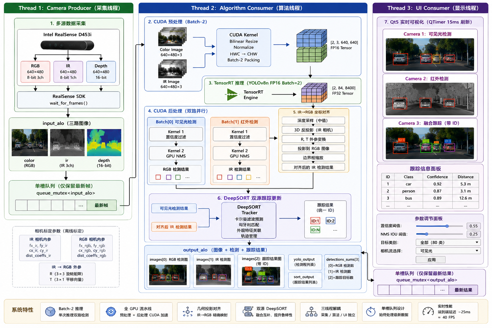

# 多源融合实时目标检测与跟踪系统

基于 YOLOv8 + DeepSORT 的双目（可见光 + 红外）实时目标检测与多目标跟踪系统，运行于 NVIDIA Jetson Orin 平台。

## 系统架构


## 核心功能

- **双模态融合检测** — 可见光与红外图像通过 batch-2 TensorRT 推理同时检测，GPU 资源高效利用
- **跨模态坐标对齐** — 红外检测结果通过相机外参矩阵投影到可见光坐标系，实现真正意义上的多源融合
- **全 GPU 流水线** — 预处理（双线性插值缩放 + 归一化）和后处理（置信度过滤 + NMS）均以 CUDA kernel 实现
- **DeepSORT 多目标跟踪** — 卡尔曼滤波 + 匈牙利算法数据关联，支持双源（可见光 + 红外）逐帧更新
- **实时深度测距** — 基于深度图在检测框中心采样，实时输出目标距离（米）
- **Qt5 暗色主题界面** — 三路实时画面（可见光检测 / 红外检测 / 融合跟踪），支持 GUI 参数调节

## 技术栈

| 类别 | 技术 |
|---|---|
| 开发语言 | C++17 + CUDA |
| 构建系统 | CMake 3.16+ |
| 界面框架 | Qt5 (Widgets) |
| 相机硬件 | Intel RealSense D453i (librealsense2) |
| 推理引擎 | NVIDIA TensorRT (NvInfer + NvOnnxParser) |
| GPU 计算 | CUDA (预处理/后处理 kernel) |
| 目标平台 | NVIDIA Jetson Orin (SM 8.7) |
| 跟踪算法 | DeepSORT (卡尔曼滤波 + 匈牙利算法) |
| 检测模型 | YOLOv8n (ONNX → TensorRT engine) |
## 数据流

1. **采集线程** — `RealSenseController::capture_loop()` 从 D453i 采集同步的可见光 / 红外 / 深度帧，推入线程安全队列
2. **算法线程** — `Algorithm::capture_loop()` 从队列取帧，执行：
   - `prescope()`: CUDA kernel 将 640×480 图像缩放至 640×640，归一化后排列为 batch-2 CHW 张量
   - `infer()`: TensorRT 以 batch_size=2 执行 YOLOv8n 推理（可见光 + 红外各一份）
   - `postscope()`: CUDA kernel 过滤置信度 + NMS，分别输出两路检测结果
   - `my_tracker::update()`: 红外检测坐标→3D→可见光2D投影对齐，再喂入 DeepSORT 进行双源跟踪
3. **界面线程** — QTimer 每 15ms 触发刷新，三路画面分别显示可见光检测、红外检测、融合跟踪结果

## 运行时配置（GUI）

- 置信度阈值（默认 0.55）
- IOU / NMS 阈值（默认 0.25）
- 目标类别过滤（COCO 80 类，支持弹窗选择）
- 相机流类型 / 分辨率切换

## 编译构建

```bash
mkdir build && cd build
cmake ..
make -j$(nproc)
```

**依赖项**: CUDA Toolkit, TensorRT, OpenCV, Qt5, librealsense2, Eigen 3.3.9

> 注意: 模型 engine 路径和 Eigen 路径当前硬编码为 Jetson Orin 开发环境。在其他机器上编译前，请修改 `yolo_datatype.h` 和 `CMakeLists.txt` 中的路径。
## 项目结构

```
.
├── CMakeLists.txt
├── src/
│   ├── main.cpp                    # 应用程序入口
│   └── mainwindow.cpp              # Qt5 界面实现
├── include/
│   └── mainwindow.h                # 主窗口类声明
├── common/include/
│   ├── data.h                      # 相机配置与数据结构定义
│   └── FrameDispatcher.h           # 线程安全单槽队列
├── d453i/
│   ├── include/RealSenseController.h   # 相机控制器类声明
│   └── src/realsensecontroller.cpp     # 相机采集线程（生产者）
├── algorithm/
│   ├── common/logg.h               # TensorRT 日志器 + CUDA 错误检查宏
│   ├── alg_pipeline/
│   │   ├── include/algorithm.h     # 算法管线类声明
│   │   └── src/alglorithm.cpp      # YOLO + SORT 管线线程（消费者）
│   ├── yolo/
│   │   ├── include/yolov8.h        # TensorRT YOLOv8 类声明
│   │   ├── include/yolov8cu.h      # CUDA kernel 声明
│   │   ├── common/
│   │   │   ├── yolo_datatype.h     # 核心数据结构（检测框、输入输出、配置）
│   │   │   └── trt_utils.h         # TensorRT/CUDA 智能指针删除器
│   │   └── src/
│   │       ├── yolov8.cpp          # 引擎加载 / 推理 / 流水线调度
│   │       └── postscope.cu        # CUDA 预处理 + NMS 后处理 kernel
│   └── sort/
│       ├── include/my_tracker.h    # 跟踪器封装类声明
│       ├── src/my_tracker.cpp      # 红外→可见光坐标对齐 + DeepSORT 更新
│       └── 3rdparty/deepsort/      # DeepSORT C++ 第三方实现
```


## 许可证

私有项目，保留所有权利。
